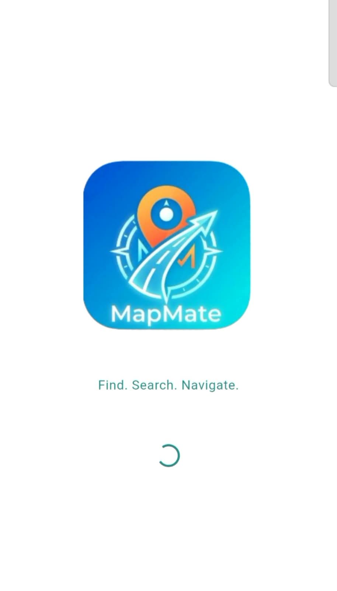
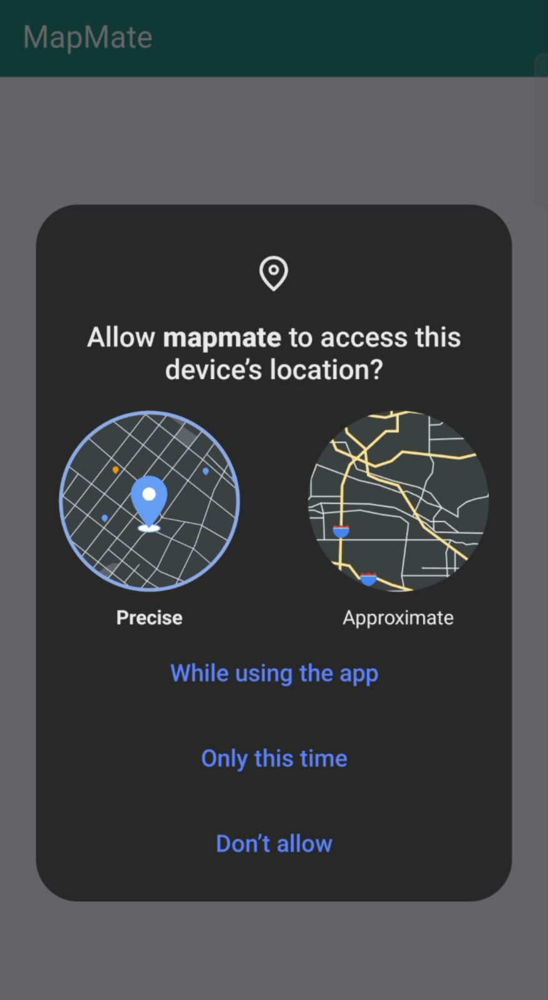
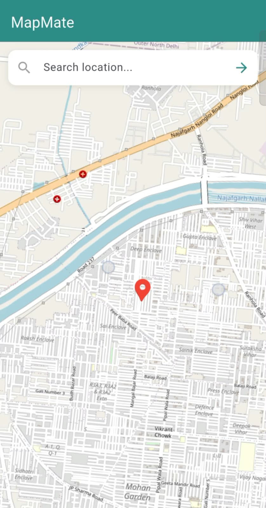
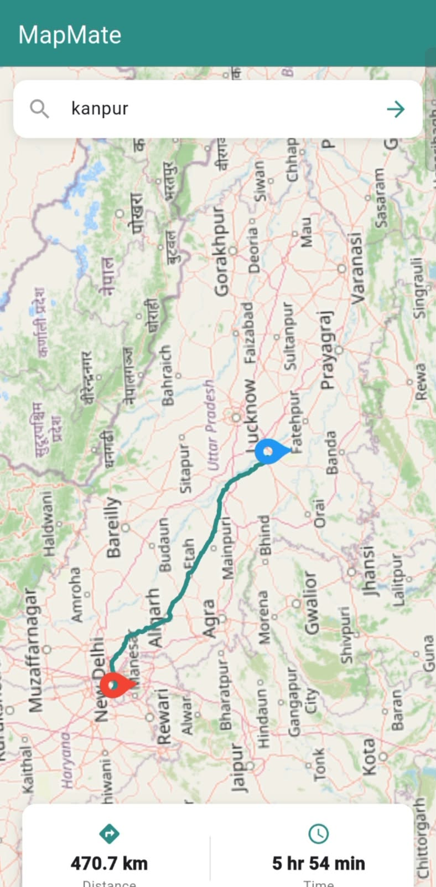

# MapMate 🗺️

A Flutter demo app for real-time location search, marker placement,
and route navigation — built using OpenStreetMap (no API key required).

## Features
- Current location detection with permission handling
- Location search (Nominatim API)
- Route/direction with distance & time (OSRM API)
- Clean error handling (GPS off, permission denied states)

## Tech Stack
- Flutter
- Geolocator
- Dio (API calls)
- flutter_map + OpenStreetMap tiles

## Screenshots

| Splash Screen                      | Permission Popup                                |
|------------------------------------|-------------------------------------------------|
|  |  |

| Home Screen                    | Search & Route                   |
|--------------------------------|----------------------------------|
|  |  |

## Demo Video
https://github.com/user-attachments/assets/9c283c65-c165-4591-a1cf-b6375905a506

## Setup
\`\`\`bash
flutter pub get
flutter run
\`\`\`
